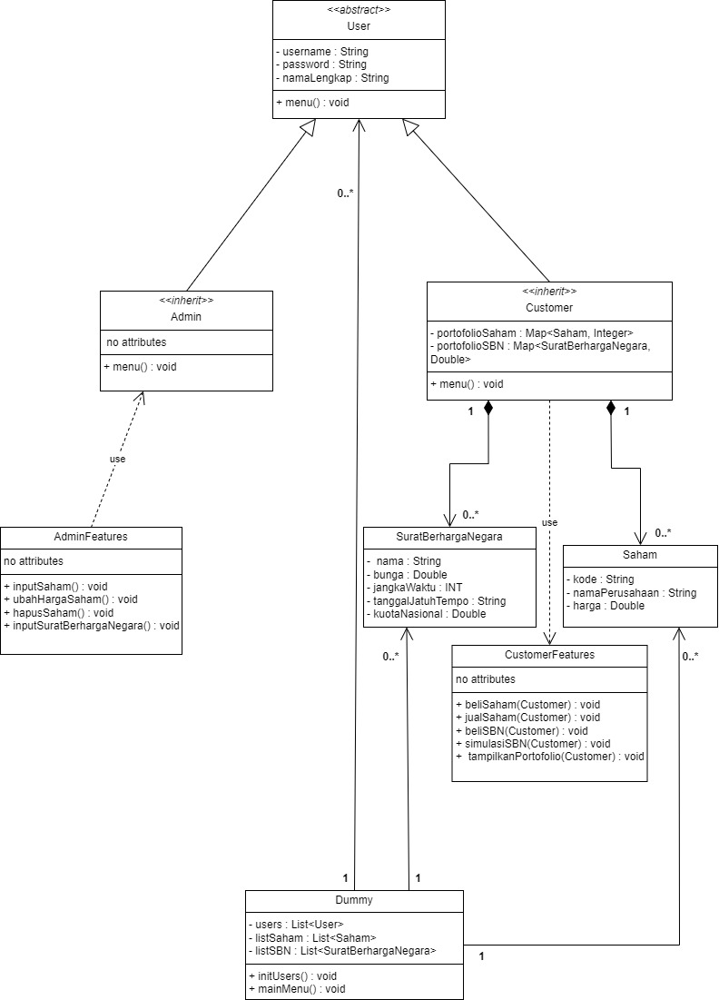
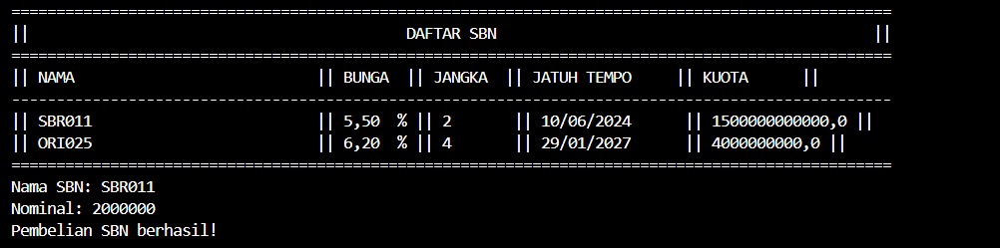

# PBO-Tugas1
## 📝 Pembuatan Program Investasi Sederhana
✨ Hi!! Selamat dattang di proyek kecil kami!

Ini merupakan suatu poyek kecil bertema Sistem Investasi saham dan Surat Bergharga Negara (SBN) yang di mana dibuat untuk menuntaskan Tugas 1 Pemrograman Berorientasi Objek (PBO).

Program Java ini dirancang untuk dua jenis user dengan akses yang berbeda, yaitu:

● Admin diberikan akses untuk mengelola sistem investasi, seperti:
  1. Menambahkan data saham baru
  2. Mengubah harga saham
  3. Melihat daftar saham
  4. Menghapus data saham
  5. Menambahkan data Surat Berharga Negara (SBN)
  6. Lihat daftar SBN
  7. Menghapus SBN

● Customer diberikan akses untuk melakukan aktivitas investasi, seperti:
  1. Melihat daftar saham
  2. Membeli saham
  3. Menjual saham
  4. Membeli Surat Berharga Negara (SBN)
  5. Melihat Portofolio investasinya

Selain itu, program ini juga dilengkapi dengan validasi input sederhana pada bagian pilihan menu, hal ini dilakukan untuk memastikan penggua hanya dapat memilih opsi yang sesuai dengan ketentuan program.

## Anggota Kelompok
- Putu Della Pradnyaswari Cipta Dewi (2405551063)
- Ida Ayu Ratih Widya Paramitha (2405551111)

## UML

## Penggunaan Program
Di bawah ini merupakan penggunaan program Investasi Saham beserta hasil screenshoot. Beberapa penjelasan bagaimana kode berjalan di jelaskan di bawah.

## Login Admin dan Customer
(foto tampilan awal)
(foto login admin)
(foto login customer)
Setelah user memilih melakukan login sebagai role apa, user akan diminta untuk menginputkan username dan passwordnya. Jika benar maka akan mengeluarkan output seperti gambar di atas, jika salah maka akan keluar pesan kesalahan dan perintah untuk memasukkan username dan password yang benar.

## Menu Admin
(ss menu admin)
Setelah melakukan login sebagai admin, maka user akan diberi intruksi kembali pada menu admin seperti gambar di atas. Admin akan diminta untuk memilih opsi di atas dengan menginputkan angka.

## Tambah Saham
(ss menu memilih 1. tambah saham)
(ss setelah memasukkan kode saham, nama perusahaan, dsb)
Untuk menambahkan saham, admin harus memasukkan kode saham, nama perusahaan, dan harga per-lembar saham. Pada saat memasukkan kode saham dan nama perusahaan, terdapat validasi agar tidak ada input kosong yang terbaca. Terdapat validasi juga pada saat memasukkan harga per-lembar saham agar harga harus lebih besar dari 0. Setelah semua input benar, maka akan ada output sukses "Saham Berhasil ditambahkan!" seperti pada gambar.

## Daftar Saham Setelah ditambahkan
(ss daftar saham setelah ditambah)
Gambar di atas merupakan daftar beberapa saham yang sudah ditambah. Terdapat tiga saham yang ditambah yaitu BBCA, BBNI, dan ANTAM. Tampilan pada daftar saham sudah otomatis mengkalikan harga per-lembar saham dengan jumlah 1 lot saham (100 lembar), jadi tampilan harganya yaitu harga per-lembar x 100 lembar.

## Ubah Harga Saham
(ss menu pilih 2. ubah harga saham)
(ss memasukkan kode saham yang akan dirubah dan harga baru nya)
Terdapat fitur ubah harga saham pada menu admin jika terjadi kenaikan atau penurunan harga saham sesuai dengan kondisi perusahaan. Saat mengubah harga saham, admin perlu memasukkan kode saham yang akan diubah dan harga per-lembar saham yang baru. Ada validasi untuk mencari kode saham yang dirubah, jika kode saham tidak ada maka akan ada output kesalahan "Saham tidak ditemukan". Pada saat memasukkan harga baru saham juga terdapat validasi bahwa harga harus lebih besar dari 0.

## Daftar Saham Setelah Perubahan Harga
(ss daftar saham setelah diubah)
Perubahan harga saham juga otomatis tercatat pada daftar saham. Seperti contoh pada gambar, harga per-lot saham BBNI sebelumnya adalah Rp 750000 dan setelah diubah harga per-lotnya yang baru menjadi Rp 400000.

## Hapus Saham
(ss menu pilih 4. hapus saham)
(ss memasukkan kode saham yang ingin dihapus)
Admin bisa menghapus saham hanya dengan memasukkan kode saham yang akan dihapus. Terdapat validasi untuk mengecek apakah kode saham yang akan dihapus ada atau tidak. Jika ada, maka akan ada pesan berhasil "Saham berhasil dihapus!" seperti pada gambar.

## Daftar Saham Setelah dihapus
(ss daftar saham setelah dihapus)
Perubahan daftar saham yang dihapus atau ditambah juga otomatis tercatat pada daftar saham. Seperti contoh pada gambar, pada daftar saham sebelumnya menampilkan 3 saham yang ada, yaitu BBCA, BBNI, dan ANTAM. Setelah menghapus saham "ANTAM", saham yang baru saja dihapus tidak akan ditampilkan seperti pada gamnbar di atas. Jadi sekarang yang tersisa hanya 2 saham, yaitu BBCA dan BBNI.

## Tambah SBN
(ss menu pilih 5. tambah SBN)
(ss memasukkan nama sbn, bunga, jangka waktu, dsb)
Untuk menambah SBN, admin harus memasukkan nama SBN, bunga, jangka waktu, jatuh tempo, dan kuota nasional. Terdapat validasi untuk mengecek bahwa semua input tidak boleh ada yang kosong, input hanya boleh berupa angka, dan angka yang dimasukkan harus lebih besar dari 0.

## Daftar SBN Setelah ditambah
(ss menu pilih 6. lihat daftar sbn)
(ss daftar sbn yang ada)
Gambar di atas merupakan daftar beberapa SBN yang sudah ditambah. Terdapat tiga SBN yang ditambah yaitu SBR011, ORI025, dan SR019. Tampilan pada daftar saham sudah lengkap dan jelas berisi informasi bunga, jangka waktu, jatuh tempo, dan kuota nasional.

## Hapus SBN
(ss menu pilih 7. hapus sbn)
(ss masukin nama sbn yang akan dihapus)
Admin bisa menghapus SBN hanya dengan memasukkan nama SBN yang akan dihapus. Terdapat validasi untuk mengecek apakah nama SBN yang akan dihapus ada atau tidak. Jika ada, maka akan ada pesan berhasil "SBN berhasil dihapus!" seperti pada gambar.

## Daftar SBN Setelah dihapus
(ss daftar sbn setelah dihapus)
Perubahan daftar SBN yang dihapus atau ditambah juga otomatis tercatat pada daftar saham. Seperti contoh pada gambar, pada daftar saham sebelumnya menampilkan 3 SBN yang ada, yaitu SBR011, ORI025, dan SR019. Setelah menghapus saham "SR019", SBN yang baru saja dihapus tidak akan ditampilkan seperti pada gamnbar di atas. Jadi sekarang yang tersisa hanya 2 SBN, yaitu SBR011 dan ORI025.

## Menu Customer
(ss menu customer)
Setelah melakukan login sebagai customer, maka user akan diberi intruksi kembali pada menu customer seperti gambar di atas. Admin akan diminta untuk memilih opsi di atas dengan menginputkan angka.

## Lihat Daftar Saham
(ss menu pilih 1. lihat daftar saham)
(ss menampilkan daftar saham)
Customer dapat melihat daftar saham apa saja yang ada, lengkap dengan informasi kode saham, nama perusahaan, dan harga per-lot.

## Beli Saham
(ss menu pilih 2. beli saham)
(ss masukin kode saham yang akan dibeli dan jumlah lot)
Customer cukup memasukkan kode saham dan jumlah lot dari saham yang ingin dibeli. Terdapat validasi untuk memastikkan bahwa jumlah nominal yang dibeli lebih dari 0 dan validasi untuk memastikan bahwa saldo customer cukup untuk melakukan transaksi.

## Cek Portofolio Setelah Membeli Saham
(ss menu pilih 6. lihat portofolio)
(ss portofolio baru ada saham aja)
Portofolio customer baru terisi 1. Karena customer baru melakukan transaksi sekali, yaitu membeli saham BBCA sebanyak 3 lot dengan nilai investasi sebanyak Rp 2580000.

## Lihat Daftar SBN
(ss menu pilih 4. lihat daftar SBN)
(ss tampilan daftar SBN yang ada)
Customer dapat melihat daftar SBN apa saja yang ada, lengkap dengan informasi nama SBN, bunga, jangka waktu, jatuh tempo, dan kuota nasional.

## Beli SBN
(ss menu pilih 5. beli SBN)
(ss masukin nama sbn dan nominal)
Untuk membeli SBN, customer cukup memasukkan nama SBN dan besaran nominal SBN yang akan dibeli. Terdapat validasi untuk memastikkan bahwa jumlah nominal yang dibeli lebih dari 0 dan validasi untuk memastikan bahwa saldo customer cukup untuk melakukan transaksi.

## Cek Portofolio Setelah Membeli SBN
(ss menu pilih 6. lihat portofolio)
(ss portofolio setelah beli SBN)
Portofolio kali ini sudah terisi semua, yang sebelumnya hanya ada portofolio saham saja kini portofolio SBN sudah terisi karena customer sudah melakukan transaksi pembelian SBN.

## Jual Saham
(ss menu pilih 3. jual saham)
(ss menu masukin kode saham dan jumlah lot)
Untuk menjual saham, customer hanya perlu memasukkan kode saham dan jumlah lot saham yang akan dijual. Terdapat validasi untuk memastikan ada atau tidaknya kode saham yang dimasukkan dan penjualan saham harus lebih besar dari 0.

## Cek Portofolio Setelah Menjual saham
(ss portofolio customer)
Portofolio pada customer akan otomatis ter-update ketika terjadi transaksi seperti membeli saham, membeli SBN, ataupun menjual saham. Pada gambar di atas, portofolio saham berkurang karena customer baru saja menjual sahamnya sebanyak 1 lot dan nilai investasi pada sahamnya juga ikut berkurang.

## Keluar Program
Ketika memilih 3. Keluar, maka user akan keluar dari program dan akan keluar output "Terima kasih sudah menggunakan program!".
